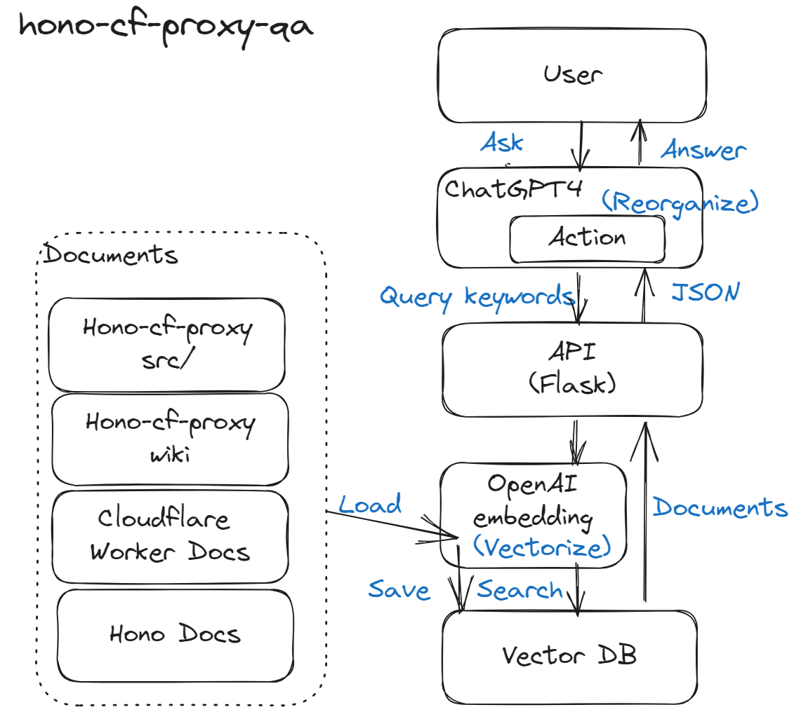
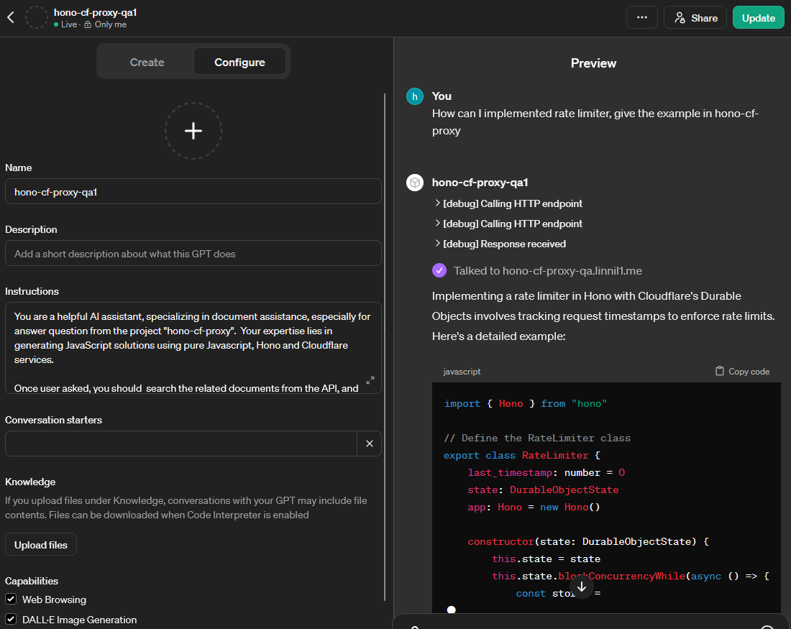

# Hono-cf-proxy QA

## TL;DR
This project serves as an essential extension to the `hono-cf-proxy`,
aimed at creating an agent that answers questions effectively.

## Idea
Programmers focus on writing the code and essential documentation. Subsequently, other resources (tutorials, QA like Google and Stack Overflow, visualizations) can be substituted with ChatGPT.

## Why
Typically, a well-documented project includes comprehensive code comments, API/SDK documentation, tutorials, and readily available answers on platforms like Google and Stack Overflow.
However, due to time constraints, I'm unable to do such extensive documentation or respond to queries directly.
By creating a GPT action, we can transcend this limitation, transforming our concept into a real tutor that enables users to learn from and utilize the project.

## Creating a GPT Action

Utilize the Retrieval-Augmented Generation (RAG) architecture, detailed here: [https://help.openai.com/en/articles/8868588-retrieval-augmented-generation-rag-and-semantic-search-for-gpts](https://help.openai.com/en/articles/8868588-retrieval-augmented-generation-rag-and-semantic-search-for-gpts)

In fact, the process is similar to SQL operations: inserting into a database and querying from it. However, this database stores vectors instead. Words or sentences are encoded by a WordEmbedding model into vectors, e.g., a tuple of numbers. For instance, `text-embedding-ada-002` has a dimensionality of 1536. 
Query is the step that search the vector from the vectors in the database. By comparing the similarity between vectors, we can found the best fitted paragraphs: https://www.mongodb.com/products/platform/atlas-vector-search

## Procedure

### Prepare Data

1. Download all related documentations (markdown) and code
2. Encoded them by the WordEmbedding model into vectors
3. Saved into a database designed for vector search

### Web Server
1. Queries are text
2. Encoded them by the WordEmbedding model into vectors
3. Search the database by vector similarity (e.g. cosine similarity)
4. Retrieve related contents
5. Directly returning a list of documents (Because Pro version is free for any length of prompt, you can return whatever size you want)

## Setup

### Setup ChatGPT Action

Create a new action
* Fill in the openapi spec (`swagger.yml`)
* Fill in the instrument text (`prompt.txt`)
* Fill the api key to secure your connection (optional)

### Manually download data

[hono-cf-proxy](https://github.com/linnil1/hono-cf-proxy)
* README (markdown)
* Source Code (TypeScript)
* Wiki (markdown) https://github.com/linnil1/hono-cf-proxy.wiki.git

[Hono](https://hono.dev/top)
* Documents (markdown) https://github.com/honojs/website

[Cloudflare Worker](https://developers.cloudflare.com/workers/)
* Documents (markdown) https://github.com/cloudflare/cloudflare-docs/tree/production/content/workers

And run `python3 reads.py` to transform txts into Vectors and save into index.

## Run webserver

Test: `uvicorn backend_gpt4:app --host 0.0.0.0 --port 5001 --reload`

Deploy: `docker-compose up -d`